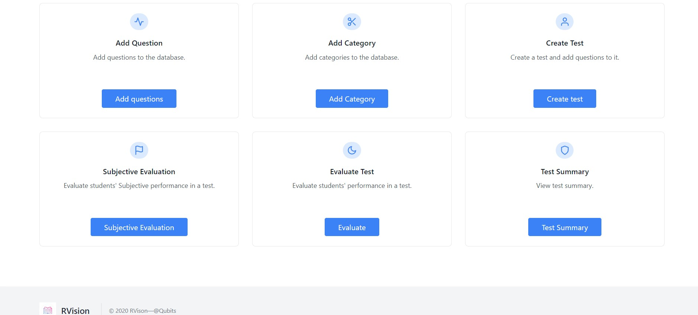

# RVision  
### A web application to make online evaluation easier

In recent times, the pandemic situation has brought major changes in the way educational
institutions function. The need has come to conduct assessments online - and this need is here to
stay. Many institutions that have tried to adapt existing online communication systems for
conducting examinations, such attempts have eventually been a failure. The workarounds burden
both the students taking these examinations and the faculty members that design the tests.
Therefore we propose a system to automate the entire process using which assessment can be
conducted online in an improved manner.

### Our online assessment system (OAS)

The OAS proposed is a web application capable of running on any
desktop or laptop browser to facilitate online assessment. The system is intended to be deployed
and maintained by educational institutions to conduct assessments. The faculty and the students
are expected to access the system via a computer browser.

